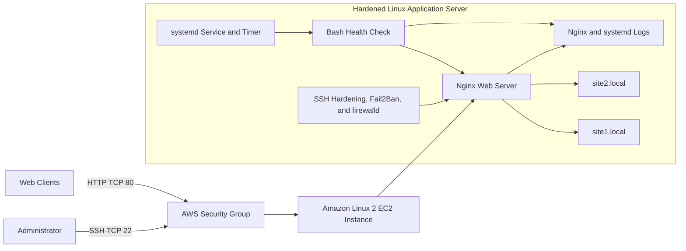

# AWS Linux Application Server: Nginx Hosting, Monitoring, and Security Hardening

## Overview

This hands-on portfolio project demonstrates how an Amazon Linux 2 EC2 instance can be configured as a multi-site Nginx application server and managed with practical Linux administration controls. The build includes virtual hosting, user and group ownership, POSIX permissions, application and system logs, Bash health checks, systemd automation, SSH hardening, Fail2Ban, and firewalld.

The project also documents the troubleshooting performed when networking, permissions, process credentials, and security monitoring did not behave as expected.

This is a project-based training environment created to practice AWS and Linux administration. It is not presented as a production deployment.

## Architecture



## Technologies Used

- AWS CLI, Amazon EC2, VPC networking, route tables, internet gateways, and security groups
- Amazon Linux 2
- Nginx virtual hosts/server blocks
- Linux users, groups, POSIX permissions, and setgid
- Bash scripting and HTTP health validation with `curl`
- systemd services, timers, and journal logging
- SSH key-based authentication and root-login restrictions
- Fail2Ban and firewalld
- Nginx access and error logs

## Project Objectives

- Provision an EC2-based Linux application server through the AWS CLI.
- Install Nginx and configure it to start automatically.
- Host two independent websites with separate content and logs.
- Apply controlled ownership and group-based access to web content.
- Add branded error pages and validate Nginx configuration changes.
- Build a Bash health check for Nginx, port 80, and both websites.
- Run the health check automatically through a systemd timer.
- Harden remote access and add layered host-level security controls.
- Diagnose failures using logs and structured troubleshooting.

## Phase 1: Provisioning and Network Connectivity

The environment was provisioned through the AWS CLI using an EC2 instance, a key pair, and a security group permitting the required administrative and web traffic. SSH access should be restricted to an approved source address; private key files and live resource identifiers must never be committed.

The initial SSH connection failed even though the instance was running and the security group rules appeared correct. Troubleshooting showed that the VPC did not have a complete internet path. Attaching an internet gateway and verifying an active default route restored connectivity.

After connectivity was established, Nginx was installed and enabled:

```bash
sudo amazon-linux-extras enable nginx1
sudo yum install -y nginx
sudo systemctl enable --now nginx
```

## Phase 2: Multi-Site Hosting and Operations

Two document roots were created for independent sites:

```bash
sudo mkdir -p /var/www/site1/html /var/www/site2/html
sudo nginx -t
sudo systemctl reload nginx
```

The sample server-block configurations in [`configs/`](configs/) provide separate content roots, access logs, error logs, and internal custom error pages for `site1.local` and `site2.local`.

Dedicated site-owner accounts and a shared web-development group were used to separate content ownership from the Nginx service account:

```bash
sudo groupadd webdev
sudo useradd -m -s /bin/bash -G webdev site1owner
sudo useradd -m -s /bin/bash -G webdev site2owner
sudo usermod -aG webdev nginx
```

After the Nginx account was added to the group, the running worker processes still held their original group membership. Restarting Nginx refreshed the process credentials:

```bash
sudo systemctl restart nginx
```

The [`webserver_healthcheck.sh`](scripts/webserver_healthcheck.sh) script validates:

1. The Nginx service is active.
2. TCP port 80 is listening.
3. `site1.local` returns HTTP 200.
4. `site2.local` returns HTTP 200.

It records timestamped results and returns exit code `0` for a healthy server or `1` when any check fails.

## Phase 3: Security Hardening and Automation

SSH was configured for key-based authentication with password authentication and direct root login disabled. Before ending the active session, access was validated from a second independent SSH session.

Fail2Ban was configured to monitor SSH authentication events. Testing showed that rejected key attempts were logged as connection-reset events rather than the pattern expected by the default filter. The SSH jail was changed to aggressive mode and tested again to confirm detection and banning.

Firewalld provided a host-level control in addition to the AWS security group:

```bash
sudo firewall-cmd --permanent --add-service=ssh
sudo firewall-cmd --permanent --add-service=http
sudo firewall-cmd --reload
```

The health-check script was connected to a systemd oneshot service and timer. The timer runs the check every five minutes and exposes its results through `journalctl`.

## Validation

- Confirmed Nginx started automatically and served a custom page.
- Confirmed both virtual hosts returned their correct content.
- Verified custom 404 pages could only be served as error responses.
- Reviewed per-site access and error logs.
- Confirmed site owners controlled content while Nginx retained read access.
- Stopped Nginx to verify the health check returned HTTP `000`, reported an unhealthy state, and exited with code `1`.
- Restarted Nginx and confirmed the health check returned to a healthy state with exit code `0`.
- Validated SSH key access before closing the original administrative session.
- Triggered controlled authentication failures to test Fail2Ban detection, banning, and unbanning.
- Confirmed firewalld exposed only the intended services.

## Troubleshooting Highlights

Detailed troubleshooting notes are available in [`docs/troubleshooting.md`](docs/troubleshooting.md).

Key lessons included:

- A public IP requires a working internet gateway and route-table path.
- CloudShell storage should not be treated as durable storage for private keys.
- A configuration reload does not refresh a running process's group membership.
- Service status alone does not prove that a security control detects the expected log pattern.
- Remote-access changes should be validated from a second session before the original session is closed.

## Security Considerations

- Restrict SSH to an approved source address or controlled administrative path.
- Never commit private keys, AWS credentials, account numbers, public addresses, or live resource identifiers.
- Use key-based authentication and disable direct root login.
- Validate SSH configuration with `sshd -t` before restarting the service.
- Keep AWS security groups and the host firewall limited to required traffic.
- Run web-service workers without interactive login privileges.
- Treat the included files as training examples and review them before production use.
- Stop or delete test resources after validation to avoid unnecessary charges.

## Repository Contents

```text
.
|-- README.md
|-- configs/
|   |-- fail2ban-sshd.local.example
|   |-- site1.conf.example
|   |-- site2.conf.example
|   |-- webserver-healthcheck.service
|   `-- webserver-healthcheck.timer
|-- docs/
|   `-- troubleshooting.md
|-- scripts/
|   `-- webserver_healthcheck.sh
`-- .gitignore
```

## Future Improvements

- Provision the VPC, security group, and EC2 instance with Terraform.
- Replace direct administrative SSH access with AWS Systems Manager Session Manager.
- Add HTTPS with an Application Load Balancer or a managed certificate.
- Publish health-check results as Amazon CloudWatch custom metrics.
- Add automated configuration validation through a CI/CD workflow.
- Replace local host-file entries with managed DNS records.

